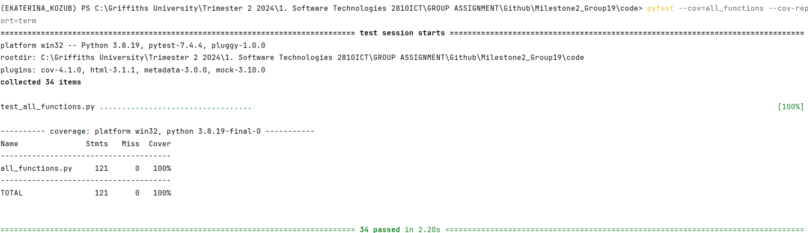
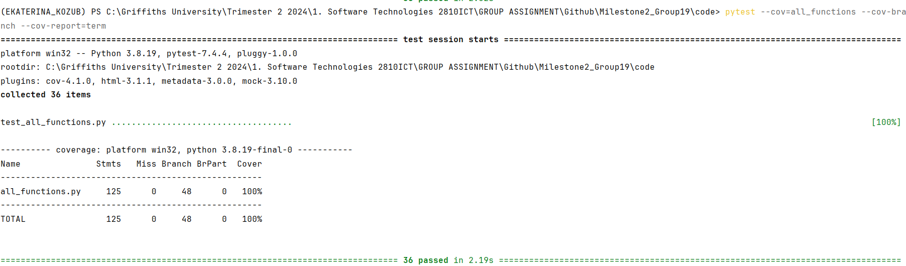

# Coverage Testing Report

Please provide your GitHub repository link.
### GitHub Repository URL: https://github.com/UniKatya/Milestone2_Group19.git

---

The testing report should focus solely on <span style="color:red"> testing all the self-defined functions related to 
the five required features.</span> There is no need to test the GUI components. Therefore, it is essential to decouple your code and separate the logic from the GUI-related code.

You should perform statement coverage testing and branch coverage testing. For each type, provide a description and an analysis explaining how you evaluated the coverage.

## 1. **Test Summary**
list all tested functions related to the five required features:

| **Tested Functions**                                                 |
|----------------------------------------------------------------------|
| `load_data(file_path)`                                               | 
| `search_food_by_name(food_name)`                                     |
| `get_nutritional_info(food_name)`                                    |
| `filter_nutritional_info(nutritional_info)`                          |
| `create_pie_chart(filtered_sizes, filtered_categories, explode, ax)` |
| `create_bar_graph(filtered_categories, filtered_sizes, ax)`          |
| `filter_food_by_nutrient_range(nutrient, min_val, max_val)`          |
| `filter_food_by_nutrient_level(nutrient, level)`                     |
| `get_food_details(food_name, meal_plan)`                             |
| `generate_meal_plan(meal_plan, food_name, quantity)`                 |
| `generate_total_calories(meal_plan)`                                 |
| `remove_food_from_meal_plan(meal_plan, food_name, quantity)`         |
| `DataTable.GetNumberRows()`                                          |
| `DataTable.GetNumberCols()`                                          |
| `DataTable.GetValue(row, col)`                                       |
| `DataTable.SetValue(row, col, value)`                                |
| `DataTable.GetColLabelValue(col)`                                    |
| `DataTable.GetAttr(row, col, prop)`                                  |

---

## 2. **Statement Coverage Test**

### 2.1 Description

To achieve 100% statement coverage, we designed test cases to ensure that every line of code in the functions related to the five required features is executed at least once. This involves creating tests that cover all possible paths through the code, including valid and invalid inputs. For example:
- load_data(file_path) tested the function with a valid file path to ensure data is loaded successfully and an invalid file path to ensure the function handles errors properly.
- search_food_by_name(food_name) tested the function with a valid food name that exists in the database to ensure it returns True and an invalid food name that does not exist to ensure it returns False.
- get_nutritional_info(food_name) tested the function with a valid food name that exists to ensure it retrieves the correct nutritional information and an invalid food name that does not exist to ensure it handles the error properly.
- filter_nutritional_info(nutritional_info) tested the function with valid nutritional information to ensure it filters correctly and invalid nutritional information to ensure it handles errors properly.
- create_pie_chart(filtered_sizes, filtered_categories, explode, ax) tested the function with valid to ensure the pie chart is created and invalid inputs to ensure it handles errors.
- create_bar_graph(filtered_categories, filtered_sizes, ax) tested the function with valid inputs to ensure the bar graph is created and invalid inputs to ensure it handles errors.
- filter_food_by_nutrient_range(nutrient, min_val, max_val) tested the function with valid inputs to ensure it filters correctly and invalid inputs (e.g., min_val > max_val) to ensure it handles errors.
- filter_food_by_nutrient_level(nutrient, level) tested the function with valid levels to ensure it filters correctly and invalid levels to ensure it handles errors.
- get_food_details(food_name, meal_plan) tested the function with valid foods that exist in the meal plan to ensure it retrieves details and invalid names that does not exist to ensure it handles errors.
- generate_meal_plan(meal_plan, food_name, quantity) tested the function with valid food name and quantity to ensure it updates the meal plan and invalid food name or quantity (e.g., negative quantity) to ensure it handles errors.
- generate_total_calories(meal_plan) tested the function with valid meal plan to ensure it calculates total calories and invalid inputs to ensure it handles the case properly.
- remove_food_from_meal_plan(meal_plan, food_name, quantity) tested the function with valid food name and quantity to ensure it updates the meal plan and food name that does not exist or invalid quantity to ensure it handles errors.
- DataTable.GetNumberRows() tested the function with valid inputs to ensure it returns the correct number of rows.
- DataTable.GetNumberCols() tested the function with valid inputs to ensure it returns the correct number of columns.
- DataTable.GetValue(row, col) tested the function with valid row and column to ensure it returns the correct value and out-of-bounds row or column to ensure it handles errors.
- DataTable.SetValue(row, col, value) tested the function with valid row, column, and value to ensure it sets the value correctly and out-of-bounds row or column to ensure it handles errors.
- DataTable.GetColLabelValue(col) tested the function with valid column to ensure it returns the correct label and an out-of-bounds column to ensure it handles errors..
- DataTable.GetAttr(row, col, prop) tested the function with valid row, column, and property to ensure it returns the correct attribute and out-of-bounds row or column to ensure it handles errors.

### 2.2 Testing Results
You can use the following command to run the statement coverage test and generate the report in the terminal. Afterward, include a screenshot of the report. 

You must provide the test_all_functions.py file, which contains all test functions, otherwise pytest will not be able to execute the tests.

```commandline
pytest --cov=all_functions --cov-report=term
```
Note: In the command above, the file/module `all_functions` does not include the .py extension. all_functions.py should contain all the tested functions related to the five required features.



## 3. **Branch Coverage Test**

### 3.1 Description

To achieve 100% branch coverage, the test cases in test_all_functions.py were designed to cover all possible branches in the functions related to the five required features. This includes testing all possible outcomes of conditional statements. For example:
- load_data(file_path) tested the function with a valid file path to ensure data is loaded successfully and an invalid file path to ensure the function handles errors properly.
- search_food_by_name(food_name) tested the function with a valid food name that exists in the database to ensure it returns True and an invalid food name that does not exist to ensure it returns False.
- get_nutritional_info(food_name) tested the function with a valid food name that exists to ensure it retrieves the correct nutritional information and an invalid food name that does not exist to ensure it handles the error properly.
- filter_nutritional_info(nutritional_info) tested the function with valid nutritional information to ensure it filters correctly and invalid nutritional information to ensure it handles errors properly.
- create_pie_chart(filtered_sizes, filtered_categories, explode, ax) tested the function with valid to ensure the pie chart is created and invalid inputs to ensure it handles errors.
- create_bar_graph(filtered_categories, filtered_sizes, ax) tested the function with valid inputs to ensure the bar graph is created and invalid inputs to ensure it handles errors.
- filter_food_by_nutrient_range(nutrient, min_val, max_val) tested the function with valid inputs to ensure it filters correctly and invalid inputs (e.g., min_val > max_val) to ensure it handles errors.
- filter_food_by_nutrient_level(nutrient, level) tested the function with valid levels to ensure it filters correctly and invalid levels to ensure it handles errors.
- get_food_details(food_name, meal_plan) tested the function with valid foods that exist in the meal plan to ensure it retrieves details and invalid names that does not exist to ensure it handles errors.
- generate_meal_plan(meal_plan, food_name, quantity) tested the function with valid food name and quantity to ensure it updates the meal plan and invalid food name or quantity (e.g., negative quantity) to ensure it handles errors.
- generate_total_calories(meal_plan) tested the function with valid meal plan to ensure it calculates total calories and invalid inputs to ensure it handles the case properly.
- remove_food_from_meal_plan(meal_plan, food_name, quantity) tested the function with valid food name and quantity to ensure it updates the meal plan and food name that does not exist or invalid quantity to ensure it handles errors.
- DataTable.GetNumberRows() tested the function with valid inputs to ensure it returns the correct number of rows.
- DataTable.GetNumberCols() tested the function with valid inputs to ensure it returns the correct number of columns.
- DataTable.GetValue(row, col) tested the function with valid row and column to ensure it returns the correct value and out-of-bounds row or column to ensure it handles errors.
- DataTable.SetValue(row, col, value) tested the function with valid row, column, and value to ensure it sets the value correctly and out-of-bounds row or column to ensure it handles errors.
- DataTable.GetColLabelValue(col) tested the function with valid column to ensure it returns the correct label and an out-of-bounds column to ensure it handles errors..
- DataTable.GetAttr(row, col, prop) tested the function with valid row, column, and property to ensure it returns the correct attribute and out-of-bounds row or column to ensure it handles errors.

### 3.2 Testing Results
You can use the following command to run the branch coverage test and generate the report in the terminal. Afterward, include a screenshot of the report. 

You must provide the test_all_functions.py file, which contains all test functions, otherwise pytest will not be able to execute the tests.

```commandline
pytest --cov=all_functions --cov-branch --cov-report=term
```
Note: In the command above, the file/module `all_functions` does not include the .py extension. all_functions.py should contain all the tested functions related to the five required features.


