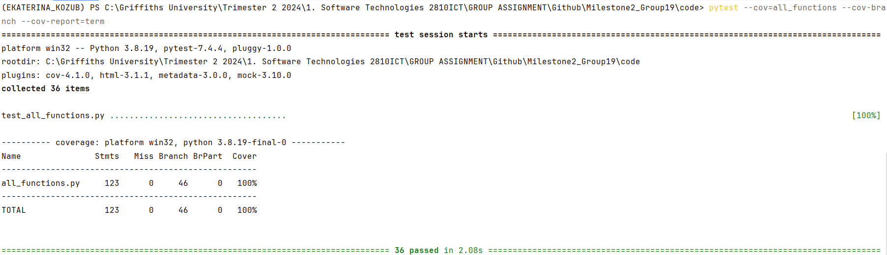

# Coverage Testing Report

Please provide your GitHub repository link.
### GitHub Repository URL: https://github.com/UniKatya/Milestone2_Group19.git

---

The testing report should focus solely on <span style="color:red"> testing all the self-defined functions related to 
the five required features.</span> There is no need to test the GUI components. Therefore, it is essential to decouple your code and separate the logic from the GUI-related code.

You should perform statement coverage testing and branch coverage testing. For each type, provide a description and an analysis explaining how you evaluated the coverage.

## 1. **Test Summary**
list all tested functions related to the five required features:

| **Tested Functions**                                                 |
|----------------------------------------------------------------------|
| `load_data(file_path)`                                               | 
| `search_food_by_name(food_name)`                                     |
| `get_nutritional_info(food_name)`                                    |
| `filter_nutritional_info(nutritional_info)`                          |
| `create_pie_chart(filtered_sizes, filtered_categories, explode, ax)` |
| `create_bar_graph(filtered_categories, filtered_sizes, ax)`          |
| `filter_food_by_nutrient_range(nutrient, min_val, max_val)`          |
| `filter_food_by_nutrient_level(nutrient, level)`                     |
| `get_food_details(food_name, meal_plan)`                             |
| `generate_meal_plan(meal_plan, food_name, quantity)`                 |
| `generate_total_calories(meal_plan)`                                 |
| `remove_food_from_meal_plan(meal_plan, food_name, quantity)`         |
| `DataTable.GetNumberRows()`                                          |
| `DataTable.GetNumberCols()`                                          |
| `DataTable.GetValue(row, col)`                                       |
| `DataTable.SetValue(row, col, value)`                                |
| `DataTable.GetColLabelValue(col)`                                    |
| `DataTable.GetAttr(col, row, col, prop)`                             |

---

## 2. **Statement Coverage Test**

### 2.1 Description

Test cases were meticulously designed to achieve 100% statement coverage and ensure that every line of code in the functions related to the five required features is executed at least once. This involves creating tests that cover all possible paths through the code through valid and invalid inputs. For example, the function load_data(file_path) was tested with a valid file path to ensure data is loaded successfully and an invalid file path to ensure the function handles errors properly. Similarly, the function search_food_by_name(food_name) was tested with food names to ensure it returns either True/False and invalid inputs such as whitespace to ensure it returns ValueError. Other functions, such as get_nutritional_info(food_name), filter_nutritional_info(nutritional_info), create_pie_chart(filtered_sizes, filtered_categories, explode, ax), create_bar_graph(filtered_categories, filtered_sizes, ax), filter_food_by_nutrient_range(nutrient, min_val, max_val), filter_food_by_nutrient_level(nutrient, level), get_food_details(food_name, meal_plan), generate_meal_plan(meal_plan, food_name, quantity), generate_total_calories(meal_plan), remove_food_from_meal_plan(meal_plan, food_name, quantity), DataTable.GetNumberRows(), DataTable.GetNumberCols(), DataTable.GetValue(row, col), DataTable.SetValue(row, col, value), DataTable.GetColLabelValue(col), and DataTable.GetAttr(col, row, col, prop), were similarly tested with both valid and invalid inputs to ensure all lines of code were executed. This testing approach ensures that every statement in the code is covered, providing confidence that the code behaves as expected under various conditions.

### 2.2 Testing Results
You can use the following command to run the statement coverage test and generate the report in the terminal. Afterward, include a screenshot of the report. 

You must provide the test_all_functions.py file, which contains all test functions, otherwise pytest will not be able to execute the tests.

```commandline
pytest --cov=all_functions --cov-report=term
```
Note: In the command above, the file/module `all_functions` does not include the .py extension. all_functions.py should contain all the tested functions related to the five required features.


## 3. **Branch Coverage Test**

### 3.1 Description

Test cases were meticulously designed to achieve 100% branch coverage and cover all possible branches in the code, ensuring that every conditional statement and its outcomes are tested. Unusual inputs are also critical to test because they often reveal edge cases that can cause unexpected behavior in the code. For example, the function search_food_by_name(food_name) tests were created for a number and a string with only whitespaces to ensure that a ValueError is raised. For generate_meal_plan(meal_plan, food_name, quantity) tests were with negative or excessively large quantities ensures that the function can handle invalid inputs. And additionally, for get_food_details(food_name, meal_plan) valid testing was with food names present in the meal plan, ensuring it returns the correct details. Edge cases included testing with a food name not in the meal plan and numeric input, all of which should raise a ValueError. These test cases ensure that the get_food_details function handles both typical and edge cases correctly. Other functions, such as load_data(file_path), get_nutritional_info(food_name), filter_nutritional_info(nutritional_info), create_pie_chart(filtered_sizes, filtered_categories, explode, ax), create_bar_graph(filtered_categories, filtered_sizes, ax), filter_food_by_nutrient_range(nutrient, min_val, max_val), filter_food_by_nutrient_level(nutrient, level), generate_total_calories(meal_plan), remove_food_from_meal_plan(meal_plan, food_name, quantity), DataTable.GetNumberRows(), DataTable.GetNumberCols(), DataTable.GetValue(row, col), DataTable.SetValue(row, col, value), DataTable.GetColLabelValue(col), and DataTable.GetAttr(col, row, col, prop), were similarly tested to ensure that the code handles boundary conditions and unusual inputs gracefully, preventing potential errors and crashes. This approach ensures that all branches, including edge cases, are thoroughly tested, providing confidence that the code handles all possible scenarios correctly.

### 3.2 Testing Results
You can use the following command to run the branch coverage test and generate the report in the terminal. Afterward, include a screenshot of the report. 

You must provide the test_all_functions.py file, which contains all test functions, otherwise pytest will not be able to execute the tests.

```commandline
pytest --cov=all_functions --cov-branch --cov-report=term
```
Note: In the command above, the file/module `all_functions` does not include the .py extension. all_functions.py should contain all the tested functions related to the five required features.


