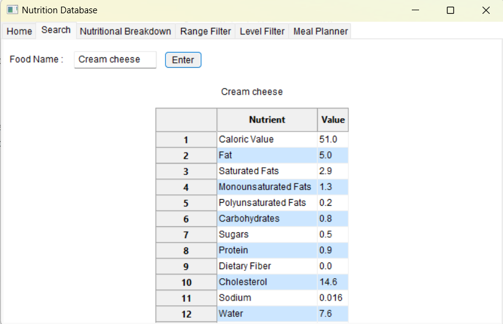
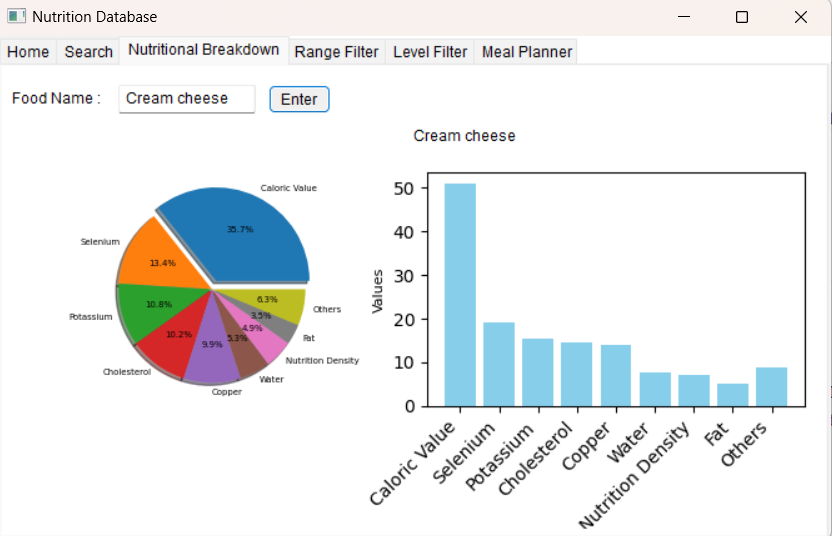

# Executive Summary

### GitHub Repository URL: https://github.com/UniKatya/Milestone2_Group19.git

---

## 1. Food Search
### Description  
Allows for the user to search for food by name and show the nutritional information from this search. 

### Steps
1. The user selects 'Search' from the navigation bar.
2. The user clicks the input box and enters the name of their desired food item.
3. The user clicks the 'Enter' button.

### Screenshots 

---

## 2. Nutritional Breakdown
### Description  
Allows for the user to see a pie chart and bar graph showing the breakdown of different nutrients from food they have chosen. 

### Steps
1. The user selects 'Nutritional Breakdown' from the navigation bar.
2. The user clicks the input box and enters the name of their desired food item.
3. The user clicks the 'Enter' button.

### Screenshots

---

## 3. Nutrient Level Filter
### Description  
Allow for the user to search for specific nutrient (including fat, protein, carbohydrates, sugar, and nutritional density) based on a particular level (low, medium, high).

### Steps
1. User selects 'Level Filter' from the navigation bar.
2. User selects a nutrient from the choice box.
3. User selects a level from one of the three radio boxes (low, medium, high).
4. User clicks the 'Enter' button.

### Screenshots
Include screenshots for each step demonstrating the use of this feature.    

---

## 4. Nutrient Range Filter
### Description  
Allows for the user to input a minimum and maximum value for specified nutrients and show the foods that fall within these ranges as list.

### Steps
1. The user selects 'Range Filter' from the navigation bar.
2. The user selects a nutrient from the choice box.
3. The user enters a minimum value for the nutrient.
4. The user enters a maximum value for the nutrient.
5. The user clicks the 'Enter' button. 

### Screenshots
Include screenshots for each step demonstrating the use of this feature.    

---

## 5. Meal Planner
### Description  
Allows for the user to plan meals and calculate the total calories for a day. This includes features such as the ability to select a food and a specified quantity, calculate the total caloric count, delete certain food items, and display the meal plan to the user.

### Steps
1. The user selects 'Meal Planner' from the navigation bar.
2. The user clicks the input box (called Food Name) and enters the name of their desired food item.
3. The user clicks the input box (called Quantity) and enters the quantity of the food item.
4. The user clicks the 'Enter' button.
5. If the user wishes to see more in depth information from selected food items, they can click the input box on the bottom right and enter the name of a meal food item.
6. The user clicks the 'Show' button below the bottom right input box.
7. If the user wishes to delete a specific meal item from the meal plan, they can click the 'Delete' button on the top right where the food details are shown for the selected item.

### Screenshots 

---
