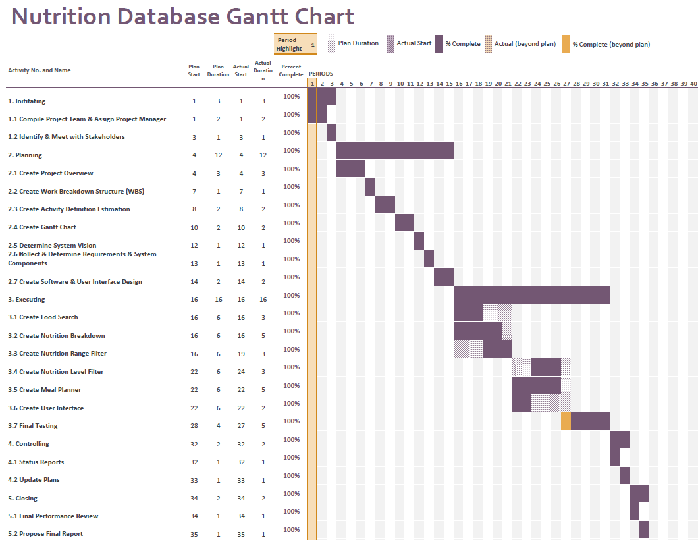

# Project Plan

## Project Name: Project Management
## Group Number: 019

### Team members

| Student No. | Full Name | GitHub Username | Contribution (sum to 100%) | 
|-------------|-----------|-----------------|----------------------------|
| s5404039    | Ekaterina Kozub | UniKatya             | 40%                        |
| s5271400    | Ella Baines-Lang | ellyiian             | 40%                        | 
| s5303300    | Fiston Kayeye | Sarvinfils         | 20%                        | 

### Brief Description of Contribution

Please Describe what you have accomplished in this group project.
- s5404039, Ekaterina Kozub
  - Accomplishments: Project Overview, Activity Definition Estimation, Gantt Chart, System Vision, Requirements, Software Design (Flowchart), Food Search (Feature), Nutritional Breakdown (Feature), general setup of project, and general reviewing and editing.
- s5271400, Ella Baines-Lang
  - Accomplishments: Work Breakdown Structure, System Components (Functions & Detailed Design), User Interface Design (Visual Design), and User Interface (Code).
- s5303300, Fiston Kayeye
  - Accomplishments: Activity Definition Estimation, Gantt Chart, Data Structures, User Interface Design (Structural Design), and Nutritional Breakown (Feature).

# Table of Contents

* [Project Plan](#project-plan)
  * [1. Project Overview](#1-project-overview)
    * [1.1 Project Objectives](#11-project-objectives)
    * [1.2 Project Stakeholders](#12-project-stakeholders)
    * [1.3 Project Scope](#13-project-scope)
  * [2. Work Breakdown Structure](#2-work-breakdown-structure)
  * [3. Activity Definition Estimation](#3-activity-definition-estimation)
  * [4. Gantt Chart](#4-gantt-chart)

## 1. Project Overview

### 1.1 Project Objectives

The project's objectives are to develop a user-friendly data analysis and visualisation tool for a comprehensive nutritional food database. This will be achieved through a Graphical User Interface (GUI) and multiple features such as allowing the user to search for foods by their name, charts that show the breakdown of the selected food, two nutrition filtering systems with a range/content level that is selected by the user, and a customisable meal planner. 

### 1.2 Project Stakeholders

Stakeholders in this project:

**Internal:**
1.	Group members 

This is the team that develops the project. They are responsible for the initiation, planning, execution, controlling, and closing of the project. Each member is responsible for specific tasks assigned to them by the Project Manager. 

2.	University Professor

This is the professor that oversees the project, guiding the team and providing feedback during the development of the project. 

3.  Project Manager

This is one of the chosen team members that organizes the team and assigns tasks to each member of the group. They coordinate tasks and makes sure that the project progresses smoothly and complies with the due dates of the project.  

**Potential End-users:**
1.	Students

The students are the primary users of the system as they will use the provided tools to search for foods and develop a better understanding of the nutritional breakdown of the searched foods. They will also be able to use this system for their own projects that require such information provided by the system. 

2.	Researchers

The researchers are the advanced users of the system as they will use the provided tools to analyse and develop their own academic/scientific projects.

3.	Health Enthusiasts

The health enthusiasts are general users that are interested in having a healthy diet provided by the platform that helps in managing their diet effectively. 

### 1.3 Project Scope

**Included:**
- User-friendly GUI designed for desktop.
- Features that provide the required services of the program (Food Search, Nutrition Breakdown, Nutrition Range Filter, Nutrition Level Filter, and Meal Planner).
- Data integration with The Comprehensive Nutritional Food Database to ensure accurate retrieval of nutritional data.
- Thorough testing of the application to ensure all features work. 
- Deployment of application on a private GitHub with multiple regular commits.

**Excluded:**
- Advanced features, such as this system being able to support multiple languages or more in depth analytics/information.
- Integration with other databases that are not The Comprehensive Nutritional Food Database.
- Advanced training manuals or support services on how to use the system.

## 2. Work Breakdown Structure

## 3. Activity Definition Estimation
The whole project will take 35 days (excluding weekends as these days will not be work days for this project). Some tasks will be done consecutively, so look at the Gantt Chart to get further detail.

| Activity #No | Activity Name | Brief Description | Duration | Responsible Team Members |
|--------------|---------------|-------------------|----------|--------------------------|
| 1          | Initiating           | Start project, assign Project Manager, and identify and meet with stakeholders.               | 3 days      | All               |
| 1.1         | Compile Project Team & Assign Project Manager           | Assemble team and determine the Project Manager.               | 2 days      | All                      |
| 1.2        | Identify & Meet with Stakeholders           | Identify key stakeholders and conduct a meeting with them.               | 1 day      | All                      |
| 2        | Planning           | Develop a detailed plan covering all aspects of the project.               | 12 days      | All                      |
| 2.1       | Create Project Overview           | Create a Project Overview Document that defines the objectives, stakeholder, and scope.               | 3 days      | Ekaterina                      |
| 2.2        | Create Work Breakdown Structure (WBS)           | Break down the project into smaller and more manageable tasks. Visualizing this through an image.               | 1 day      | Ella                      |
| 2.3        | Create Activity Definition Estimation          | From the WBS make an Activity Definition Estimation that provides a brief description, duration, and responsible team members for each task.               | 2 days      | Ekaterina & Fiston                      |
| 2.4        | Create Gantt Chart           | Create a Gantt Chart that visualizes the Activity Definition Estimation.               | 2 days      | Ekaterina & Fiston                      |
| 2.5        | Determine System Vision           | Create the System Vision Document that includes the problem background, system capabilities/overview, and potential benefits of the system.               | 1 day      | Ekaterina                      |
| 2.6        | Collect & Determine Requirements & System Components           | Collect and determine requirements, this includes user requirements, software requirements, use case diagrams, and use cases. The same will go with the System Components, which includes functions, data structures/data sources, and a detailed design.                | 1 day      | All                      |
| 2.7        | Create Software & User Interface Design           | Create a Structural, Visual, and Software Design.               | 2 days      | Ella & Fiston                      |
| 3        | Executing           | Implement the project plan and create code.              | 16 days      | All                      |
| 3.1        | Create Food Search         | Develop the Food Search function.               | 6 days      | Ekaterina                      |
| 3.2        | Create Nutrition Breakdown         | Develop the Nutrition Breakdown function.               | 6 days      | Ella                      |
| 3.3        | Create Nutrition Range Filter         | Develop the Nutrition Range Filter function.             | 6 days      | Fiston                      |
| 3.4        | Create Nutrition Level Filter         | Develop the Nutrition Level Filter function.              | 6 days      | Fiston                      |
| 3.5        | Create Meal Planner         | Develop the Meal Planner function.               | 6 days      | Ella                      |
| 3.6        | Create User Interface         | Develop the User Interface function.               | 6 days      | Ekaterina                      |
| 3.7        | Final Testing         | Test the whole system and correct errors.               | 4 days      | All                      |
| 4        | Controlling         | Monitor and control the project's progress.               | 2 days      | Ekaterina                      |
| 4.1        | Status Reports         | Generate regular status reports.               | 1 day      | Ekaterina                      |
| 4.2        | Update Plans         | Adjust plans over the projects progress.               | 1 day      | Ekaterina                      |
| 5        | Closing         | Finalize and close the project.               | 2 days      | All                      |
| 5.1     | Final Performance Review         | Review the project's performance against the objectives.               | 1 day      | All                      |
| 5.2        | Propose Final Report         | Create a final project report.               | 1 day      | All                      |

## 4. Gantt Chart

