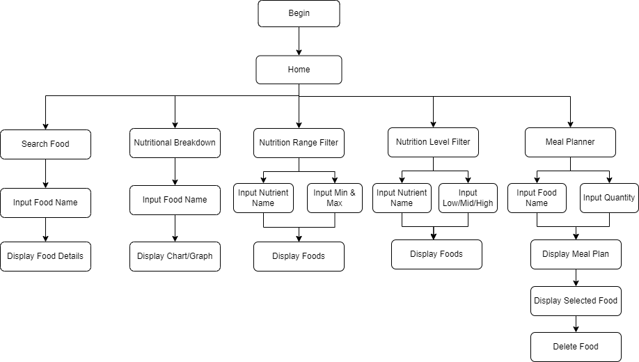
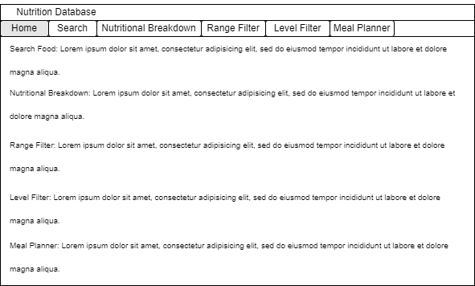
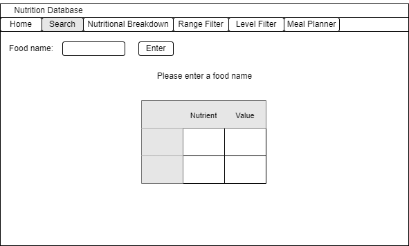
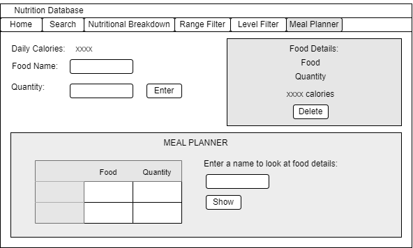

# Software Design Document

## Project Name: Project Management
## Group Number: 019

## Team members

| Student Number | Name             | 
|----------------|------------------|
| s5404039       | Ekaterina Kozub  |
| s5271400       | Ella Baines-Lang | 
| s5303300       | Fiston Kayeye    | 

# Table of Contents

<!-- TOC -->
* [Table of Contents](#table-of-contents)
  * [1. System Vision](#1-system-vision)
    * [1.1 Problem Background](#11-problem-background)
    * [1.2 System capabilities/overview](#12-system-capabilitiesoverview)
    * [1.3	Potential Benefits](#13potential-benefits)
  * [2. Requirements](#2-requirements)
    * [2.1 User Requirements](#21-user-requirements)
    * [2.2	Software Requirements](#22software-requirements)
    * [2.3 Use Case Diagrams](#23-use-case-diagrams)
    * [2.4 Use Cases](#24-use-cases)
  * [3.	Software Design and System Components](#3-software-design-and-system-components-)
    * [3.1	Software Design](#31software-design)
    * [3.2	System Components](#32system-components)
      * [3.2.1 Functions](#321-functions)
      * [3.2.2 Data Structures / Data Sources](#322-data-structures--data-sources)
      * [3.2.3 Detailed Design](#323-detailed-design)
  * [4. User Interface Design](#4-user-interface-design)
    * [4.1 Structural Design](#41-structural-design)
    * [4.2	Visual Design](#42visual-design)
<!-- TOC -->

## 1. System Vision

### 1.1 Problem Background
The program aims to address the problem of organizing, analysing, and visualizing nutritional data from a database. This is achieved through tools that retrieve, organize, filter, and analyse nutritional information from the Nutritional_Food_Database.csv database. A database that stores a wide range of foods with their nutritional information that includes calories, fats, proteins, vitamins, sugars, carbohydrates, and much more. 

The data inputs include user inputs such as food names (string), quantity for food (int), nutritional information (dict), specific nutrients (string), ranges/levels (float/string) for nutritional values, and meal plan (dict). Data outputs include specified nutritional information for a food (dict), boolean value based on found food, pie charts/bar graphs (visualization), lists of foods that are filtered by the user (list), total calories from the meal plan (int), and a personalized meal plan (dict). The target users are students (who will use this program for their personal/academic projects), researchers (who will use this program for their research/academic projects), and health enthusiasts (who will use this program to plan and manage their diet).

### 1.2 System capabilities/overview
The system will allow for organizing, analysing, and visualizing nutritional data from a database. This will pertain to searching for foods, obtaining nutritional information, visualizing nutritional information into pie charts/bar graphs, filtering foods through ranges/levels, and providing a personalized meal plan. To go into further detail of these key features and functionalities:

_Food Search_ - Allows for the user to search for food by name and show the nutritional information from this search. 

_Nutrition Breakdown_ - Allows for the user to see a pie chart and bar graph showing the breakdown of different nutrients from food they have chosen. 

_Nutrition Range Filter_ - Allows for the user to input a minimum and maximum value for specified nutrients and show the foods that fall within these ranges as list.

_Nutrition Level Filter_ - Allow for the user to search for specific nutrient (including fat, protein, carbohydrates, sugar, and nutritional density) based on a particular level (low, medium, high).

_Meal Planner_ - Allows for the user to plan meals and calculate the total calories for a day. This includes features such as the ability to select a food and a specified quantity, calculate the total caloric count, delete certain food items, and display the meal plan to the user.

### 1.3	Benefit Analysis

The following value/benefits that the program will produce:

_Health Improvement_ – The program will allow for the user to make better-informed choices for their diet through the meal planner, nutritional breakdown, and visualization and filtering of nutritional data. For example, if the user wishes to have a nutritious vegan diet that fills their daily nutritional needs but doesn't know all the foods nutritional data they can use this program to determine that and make an educated decision for their diet. Improving their diet in the process. 

_Simplifies Information Gathering_ – The program will allow for the user to find detailed nutritional information for specific foods. For example, if the user wants to manage their carbohydrate intake, they can instantly check the carbohydrate content for the different foods they intake through the search feature, simplifying the information gathering process for the user. 

_Visualizes Nutritional Makeup of Food_ – The program will allow for food to be presented in pie charts and bar graphs, visualizing nutritional makeup. For example, allowing for the user to monitor their fat intake through visualizes if they prefer this way of analysis. 

_Research Support_ – The program will provide tools for researchers to analyse nutritional data, therefore being able to contribute to the field that the researcher is working in. For example, the user can use the nutritional filter feature to aid in a research report about foods that have low contents of fat.

## 2. Requirements

### 2.1 User Requirements
Lucy, a health enthusiast, is passionate about health and fitness. She regularly exercises and is currently struggling with a balanced diet. This program will provide a personalized meticulous meal planner as well as other features that help in solving her problem. Below are the following functionalities the system must provide for Lucy to complete her objective:

_Food Search_ - Lucy needs a quick and easy way to search for foods and their nutritional information. Finding out about the number of calories, vitamins, and minerals. 

_Nutrition Breakdown_ - Lucy prefers to have a visual tool that helps her understand the nutritional breakdown of the foods she eats as it allows for her to compare different foods much better.

_Nutrition Range Filter_ - Lucy’s diet has certain nutrient limitations, such as sugar and sodium intake. She needs to filter foods based on her nutritional criteria so that she can adhere to her diet. 

_Nutrition Level Filter_ - Lucy wants to have a balanced diet, therefore she needs to filter her foods on different levels such as low, medium, and high based on nutrients such as protein or fats that are abundant in her diet. 

_Meal Planner_ - Lucy likes to plan her meals to ensure that she is adhering to her diet plans and nutritional goals. She needs a tool that allows her to select foods and the quantity for her meals, as well as calculate the total nutritional content. 

### 2.2	Software Requirements
**R1.0 Food Search**
- **R1.1** The system shall allow for users to search for food by name.
- **R1.2** The system shall show the nutritional information from the user's food search.

**R2.0 Nutrition Breakdown** 
- **R2.1** The system shall allow the user to select a food item from the database.
- **R2.2** The system shall provide a pie chart showing the breakdown of different nutrients from the food chosen by the user.
- **R2.3** The system shall provide a bar graph showing the breakdown of different nutrients from the food chosen by the user.

**R3.0 Nutrition Range Filter**
- **R3.1** The system shall allow for the user to input a specific nutrient.
- **R3.2** The system shall allow for the user to input a minimum and maximum value for specified nutrients
- **R3.3** The system shall show the foods that fall within the user specified ranges.

**R4.0 Nutrition Level Filter**
- **R4.1** The system shall allow for the user to filter food through content levels for nutrients such as protein or fats (low, medium, high).
- **R4.2** The system shall categorize these nutritional level through low (Less than 33% of the highest value), mid (Between 33% and 66% of the highest value), and high (Greater than 66% of the highest value).
- **R4.3** The system shall display a list of foods that fit into the selected level.

**R5.0 Meal Planner**
- **R5.1** The system shall allow for users to select multiple foods for the meal plan.
- **R5.2** The system shall allow for users to specify the quantities for each food item they select.
- **R5.3** The system shall calculate and display the total caloric value for the meal plan.

### 2.3 Use Case Diagram
The Use Case Diagram below include Use Cases about the five features. Food Search (Search Food), Nutrition Breakdown (View Nutritional Breakdown), Nutrition Range Filter (Filter Food List By Range), Nutrition Level Filter (Filter Food List By Level), and Meal Planner (Plan Meals).

### 2.4 Use Cases
| Use Case ID    | UC-01                                                                                                                                                                                                                                                                                                                                             |
|----------------|---------------------------------------------------------------------------------------------------------------------------------------------------------------------------------------------------------------------------------------------------------------------------------------------------------------------------------------------------|
| Use Case Name  | Search Food                                                                                                                                                                                                                                                                                                                                       |
| Actors         | User                                                                                                                                                                                                                                                                                                                                              |
| Description    | Allows for the user to search for a food by name through an input box. The system will then provide the food and it's nutritional information.                                                                                                                                                                                                    |
| Flow of Events | 1. The user selects “Food Search”.  2. The user clicks the search box.  3. The user enters the name of their desired food item.  4. The system searches the database for a match.  5. The system obtains food name and nutritional information. 6. The system provides the food and it's nutritional information to the user. |
| Alternate Flow | If the inputted food is not found by the system, then the system must display a message indicating that there are no results found.                                                                                                                                                                                                               |

| Use Case ID    | UC-02                                                                                                                                                                                                                                                                                                                                                                                                                              |
|----------------|------------------------------------------------------------------------------------------------------------------------------------------------------------------------------------------------------------------------------------------------------------------------------------------------------------------------------------------------------------------------------------------------------------------------------------|
| Use Case Name  | View Nutritional Breakdown                                                                                                                                                                                                                                                                                                                                                                                                         |
| Actors         | User                                                                                                                                                                                                                                                                                                                                                                                                                               |
| Description    | Allows for the user to view nutritional breakdown through a bar graph and pie chart of their selected food item.                                                                                                                                                                                                                                                                                                                   |
| Flow of Events | 1. The user selects “Nutritional Breakdown”.  2. The user clicks the input box.  3. The user enters the name of their desired food item.  4. The system searches the database for a match.  5. The system obtains food name and nutritional information.   6. The system makes bar graph & pie chart.  7. The system presents the bar graph & pie chart.  8. The user views the nutritional breakdown. |
| Alternate Flow | If the inputted food is not found by the system, then the system must display a message indicating that there are no results found.                                                                                                                                                                                                                                                                                                |

| Use Case ID    | UC-03                                                                                                                                                                                                                                                                   |
|----------------|-------------------------------------------------------------------------------------------------------------------------------------------------------------------------------------------------------------------------------------------------------------------------|
| Use Case Name  | Filter Food List By Range                                                                                                                                                                                                                                               |
| Actors         | User                                                                                                                                                                                                                                                                    |
| Description    | Allows for the user to filter a list of foods through the range they give to the system. The system will then filter and return a list of foods that fit inside of this range.                                                                                          |
| Flow of Events | 1. The user selects “Range Filter”.  2. The user enters nutrient.  3. The user enters the minimum and maximum value (range).  4. The system filters the food items based on the inputted values.  5. The system presents the filtered list to the user. |
| Alternate Flow | If the nutrient or range doesn't fit or exist, then the system must display a message indicating that there are no results or that the values are incorrect.                                                                                                            |

| Use Case ID    | UC-04                                                                                                                                                                                                                                                     |             
|----------------|-----------------------------------------------------------------------------------------------------------------------------------------------------------------------------------------------------------------------------------------------------------|
| Use Case Name  | Filter Food List By Level                                                                                                                                                                                                                                 |
| Actors         | User                                                                                                                                                                                                                                                      |
| Description    | Allows for the user to filter food through entering content levels (low, medium, high) for their chosen nutrient such as protein or fats.                                                                                                                 |
| Flow of Events | 1. The user selects “Level Filter”.  2. The user enters nutrient.  3. The user selects the desired level (low, mid, high).  4. The system filters the food items based on the inputted values.  5. The system presents the filtered list. |
| Alternate Flow | If the there are no foods that fit in the level, then the system must display a message indicating that there are no results found.                                                                                                                       |

| Use Case ID    | UC-05                                                                                                                                                                                                                          |
|----------------|--------------------------------------------------------------------------------------------------------------------------------------------------------------------------------------------------------------------------------|
| Use Case Name  | Plan Meals                                                                                                                                                                                                                     |
| Actors         | User                                                                                                                                                                                                                           |
| Description    | Allows for the user to create a meal plan by selecting a food and the quantity which the system will then calculate and add to the meal plan.                                                                                  |
| Flow of Events | 1. The user selects “Meal Planner”.  2. The user enters a food.  3. The user enters the quantity of the selected food.  4. The system stores and updates the meal plan.  5. The system displays the meal plan. |
| Alternate Flow | If the user enters a food that doesn't exist or the quantity is unrealistic, then the system displays an error message.                                                                                                        |

## 3.	Software Design and System Components 

### 3.1	Software Design

### 3.2	System Components

#### 3.2.1 Functions

*load_data(file_path):*
This function will load the data from the Nutritional_Food_Database.csv file into a Pandas DataFrame. The input parameter required is the file path (string) which specifies the location of the database file. The function will then return the database (DataFrame) which contains all the food items and their nutritional information. There are no side effects.

*search_food_by_name(food_name):*
This function will search the database for foods that match the food name (string) inputted by the user and will then return found (boolean) showing if the food name was found or not. There are no side effects.

*get_nutritional_info(food_name):*
This function will retrieve the nutritional information of the food selected by the user. The input parameter will be the food name (string), which identifies which food must be fetched from the database. The function will then return nutritional_info (dictionary) which is the nutritional information on the chosen food. There are no side effects.

*filter_nutritional_info(nutritional_info):* This function will filter the nutritional information of the food selected by the user. The input parameter is the nutritional information (dictionary) from the get_nutritional_info() function, this parameter allows the program to know which food item and nutritional value to filter. The function will then return filtered_nutritional_info (dictionary) which is the filtered nutritional information. There are no side effects.

*create_pie_chart(nutritional_info):* This function will create a pie chart of the nutritional information inputted. The input parameters are the  filtered_categories, filtered_sizes, explode, and ax from the filter_nutritional_info() function, this parameter allows the program to know what categories, sizes, and background size for the pie chart. The function will then return a pie chart. There are no side effects.

*create_bar_graph(nutritional_info):* This function will create a bar graph of the nutritional information inputted. The input parameter is the  filtered_categories, filtered_sizes, and ax from the filter_nutritional_info() function, this parameter allows the program to know what categories, sizes, and background size for the bar graph. The function will then return a bar graph. There are no side effects.

*filter_food_by_nutrient_range(nutrient, min_value, max_value):*
This function will search the database for foods that are within the minimum and maximum range values inputted by the user. The input parameters required are the nutrient name (string) and the minimum and maximum values (floats). These parameters specify which nutrients to search through, what is the lowest acceptable amount for the nutrient and what is the highest. The function will then return filtered_range (Dataframe) that match the requirements of the search. There are no side effects. 

*filter_food_by_nutrient_level(nutrient, level):*
This function will search the database for foods that match the level (low, medium, high), that is inputted by the user. The input parameters required are the nutrient name (string) and the nutrient level (string). These parameters specify which nutrients to search through as well as which level. The function will then return filtered_level (DataFrame) that match the requirements of the search. There are no side effects.

*get_food_details(food_name, meal_plan):* This function will retrieve the details of the food selected by the user. The input parameters required are the food name (string) and the output dictionary from the meal plan function. The food name specifies the food item chosen by the user while the meal plan specifies the meal plan provided by the user. The function will then return food_key, quantity, and total_calories saving the current food details provided by the user. There are no side effects.

*generate_meal_plan(food_name, quantity):*
This function will add food selected by the user into the user’s daily meal plan. The input parameters required are the meal_plan (dictionary), food name (string) and the quantity (integer). The meal_plan is the current user's meal plan, the food name specifies the food item chosen by the user while the quantity specifies the amount of the selected food item. The function will then return food_name and quantity, saving the current meal plan provided by the user. The side effect includes updating the meal_plan stored in the session.

*generate_total_calories(meal_plan):*
This function will calculate the total calories for the day based on the foods chosen for the user’s meal plan. The input parameter required is the output dictionary from the meal plan function. This provides the information that the function can then use to add up all the calories. The function then returns total_calories (int), which is the total calories of the meal plan. There are no side effects. 

 *remove_food_from_meal_plan(meal_plan, food_name, quantity):*
This function removes a particular food from the user's meal plan when the food is selected by the user. The input parameter required is the food name (string), the output dictionary from the meal plan function, and the selected quantity (int). The food parameter specifies which food item is to be removed from the user's meal plan and the meal plan parameter specifies where it is to be removed from.  The function doesn't return any but the side effect includes updating the meal_plan stored in the session.

 DataTable.GetNumberRows(): This function will return the number of rows in the data table. There are no side effects.

DataTable.GetNumberColumns(): This function will return the number of columns in the data table. There are no side effects.

DataTable.GetValue(row, col): This function will return the value at the specified row and column in the data table. The input is the row and col. There are no side effects.

DataTable.SetValue(row, col, value): This function will set the value at the specified row and column in the data table. The input is the row, col, and value. There are no side effects.

DataTable.GetColLabelValue(col): This function will return the labels in the data table. The input is the col. There are no side effects.

DataTable.GetAttr(col): This function will return colouring of the data table. The input is the row, col, and prop. There are no side effects.

#### 3.2.2 Data Structures / Data Sources

**Nutritional_Food_Database.csv**
- Type: DataFrame
- Usage: The food database is a complete collection of all food items and their nutritional information. It is set up as a DataFrame, with the food names and nutrients as the keys and their detailed data as the values. This setup allows for quick and efficient access to relevant information for users.
- Functions:

1. load_data(file_path): Loads the data from the Nutritional_Food_Database.csv file into a Pandas DataFrame. 
2. search_food_by_name(food_name): Searches the database for foods that match the food name inputted by the user. 
3. get_nutritional_info(food_name): Retrieves the nutritional information of the food selected by the user. 
4. filter_food_by_nutrient_range(nutrient, min_val, max_val): Searches the database for foods that are within the minimum and maximum range values inputted by the user. 
5. filter_food_by_nutrient_level(nutrient, level): Searches the database for foods that match the level (low, medium, high) inputted by the user
6. get_food_details(food_name, meal_plan): Retrieves the details of the food selected by the user. This means using the dataframe to check the calories of each food item and then adding them up to get the total calories.
7. generate_total_calories(meal_plan): Calculates the total calories for the day based on the foods chosen for the user’s meal plan. This means using the dataframe to check the calories of each food item and then adding them up to get the total calories.

**nutritional_info**
- Type: Dictionary
- Usage: This data structure is specifically designed for recording the nutritional information associated with the currently selected food item. It utilizes a dictionary format with keys representing nutrient names (such as "Protein," "Fat," and "Carbohydrates" in string format) and corresponding numerical values to indicate the quantity of each nutrient.
- Function:
1. get_nutritional_info(food_name): This function retrieves comprehensive nutritional information for a given food item from the stored data.
2. filter_nutritional_info(nutritional_info): This function filters the nutritional information of a particular food item based on user-defined criteria, ensuring that the data is tailored to the user's needs.

**meal_plan**
- Type: Dictionary
- Usage: The meal_plan is a continually updated dictionary that keeps track of the food items chosen by the user for their daily meals. Each entry in the dictionary is an object containing both the chosen food item and quantity selected by the user. This setup allows for the effective organization and management of meal data, allowing users to create and adjust their meal plans as required.
- Functions:
1. get_food_details(food_name, meal_plan): This function retrieves the details of the food selected by the user, including the food name, quantity, and total calories.
1. generate_meal_plan(meal_plan, food_name, quantity): This function adds a food item and quantity to the user's meal plan.
2. remove_food_from_meal_plan(meal_plan, food_name, quantity): This function deletes a specific food item from the meal plan to ensure that the meal data accurately reflects the user's choices.
3. generate_total_calories(meal_plan): This function calculates the total calories for the day by adding up calories of all the foods included in the meal plan.

**filtered_range**
- Type: Dataframe
- Usage: The filtered_range stores foods that fit into the minimum and maximum values of a specific nutrient. This enables precise filtering operations for users searching for foods within a specific nutritional range.
- Functions:
1. filter_food_by_nutrient_range(nutrient, min_value, max_value): This function filter and return foods with nutrient values within the defined range, ensuring accurate search results based on user criteria.

**filtered_level**
- Type: Dataframe
- Usage: The filtered_level stores foods that fit into the nutrient level (e.g., "Low," "Mid," or "High").
- Functions:
1. filter_food_by_nutrient_level(nutrient, level): This function leverages the nutrient level filters foods that correspond to the selected nutrient level, providing users with a tailored view of the database based on their input.

#### 3.2.3 Detailed Design

*load_data(file_path)*
- START 
- LOAD data from file_path INTO database 
- RETURN database

*search_food_by_name(food_name)*
- START 
- SEARCH for food_name IN database 
- RETURN found

*get_nutritional_info(food_name)*
- START 
- SEARCH for food_name IN database 
- RETRIEVE nutritional information 
- RETURN nutritional information

*filter_nutritional_info(nutritional_info)*
- START 
- FILTER nutritional_info BASED ON criteria 
- RETURN filtered_categories, filtered_sizes, explode

*create_pie_chart(filtered_sizes, filtered_categories, explode, ax)*
- START 
- CREATE pie chart USING filtered_sizes, filtered_categories, explode
- RETURN wedges, texts, autotexts

*create_bar_graph(filtered_categories, filtered_sizes, ax)*
- START 
- CREATE bar graph USING filtered_categories, filtered_sizes
- RETURN ax.bar

*filter_food_by_nutrient_range(nutrient, min_val, max_val)*
- START 
- FILTER database FOR nutrient BETWEEN min_val AND max_val 
- RETURN filtered_range

*filter_food_by_nutrient_level(nutrient, level)*
- START 
- FILTER database FOR nutrient AT level 
- RETURN filtered_level

*get_food_details(food_name, meal_plan)*
- START 
- RETRIEVE food details FROM meal_plan FOR food_name 
- RETURN food_key, quantity, total_calories

*generate_meal_plan(meal_plan, food_name, quantity)*
- START 
- ADD food_name AND quantity TO meal_plan 
- RETURN food_name, quantity

*generate_total_calories(meal_plan)*
- START 
- CALCULATE total calories FROM meal_plan RETURN total_calories
- RETURN total_calories

*remove_food_from_meal_plan(meal_plan, food_name, quantity)*
- START 
- REMOVE food_name AND quantity FROM meal_plan

*DataTable.GetNumberRows()*
- START 
- RETURN number of rows IN data table

*DataTable.GetNumberCols()*
- START 
- RETURN number of columns IN data table

*DataTable.GetValue(row, col)*
- START 
- RETURN value AT row, col IN data table

*DataTable.SetValue(row, col, value)*
- START 
- SET value AT row, col IN data table 
- RETURN None

*DataTable.GetColLabelValue(col)*
- START 
- RETURN label OF col IN data table

*DataTable.GetAttr(row, col, prop)*
- START 
- CREATE GridCellAttr 
- SET background color FOR even rows 
- RETURN GridCellAttr

## 4. User Interface Design

### 4.1 Structural Design

•	Structure Breakdown
1.	The Main Screen serves as the central point of access for users, providing a comprehensive list of features available within the application as well as a description of each function which is located in the middle of the screen. This is done so that users understand what there is to offer from this program and what each feature does in more detail. 

2.	Search Screen: Allows for the user to input the name of a specific food item through an input box and the application will then generate and display comprehensive nutritional information tailored on the search query right below the search box. This is done to make the searching process easier on the user and intuitive to use as all is required is an input box and a button that when clicked will display the results right below. 

3.	The Nutritional Breakdown Screen: Offers a visual representation of nutritional information through pie charts and bar graphs. Users have the ability to select a specific food through an input box to view detailed nutritional breakdowns. The results will display the pie graph on the right and the bar graph on the left. This is done for simplicity, as this feature only requires an input and a click of a button from the user. The information will then be displayed on the same page below the input clearly, not requiring the user to navigate anywhere else to find the results. 

4.	Level Range Screen: This screen will allow users to search for a specific nutrient based on a particular range (min & max) through three input boxes. One for nutrient, one for min value, and one for max value. Once the user chooses their desired nutrient and range they will have to click an enter button. Once clicked, the screen will show the search results below accordingly in a list. This is designed to be simple and easy to use and navigate.

5.	Level Filter Screen: This screen will allow users to search for specific nutrient (including fat, protein, carbohydrates, sugar, and nutritional density) based on a particular level (low, medium, high). There will be one input boxes for the nutrient as well as three radio buttons that correspond to the three levels (one can only be selected at a time). A button will then have to be clicked for the system to register the response so that the user can change their response if they want to. The system will then show the results right below in a clear manner. This is done to be simple and consistent with all the other screens. 

6.	Meal Planner Screen: This screen is designed to empower users to effectively organize their meals by allowing them to plan, review, and edit their meal plan. It will include a calorie counter on the upper left of the screen, updating every time the user adds a new food to the meal plan. This is done so that the user can track the amount of total calories in their meal plan. Below this there will be two input boxes for food name and quantity. After the input is registered, the system will display the meal plan as a list below on the left side. If the user wishes to look at more details of the foods in the meal planner, they can click on the search bar located on the bottom right of the screen. And after inputting the desired food name and clicking the 'Show' button the system will display the quantity and calories on the top right part of the screen. Food can also be deleted from the meal planner through a delete button that is located below the top right part of the screen where the selected food item and it's details are located.  All these features are here to simplify the meal planning process as well as make the user experience more enjoyable when using this feature.

•	Information Grouping:

1.	The Food Search Screen includes the food name and nutritional information of the searched food. 
2.	The Nutrition Breakdown Screen includes the selected food, nutritional information of the selected food, pie chart, and bar graph. 
3.	The Range Filter Screen includes the selected nutrient, range, and filtered food items. 
4.	The Level Filter Screen includes the selected nutrient, level, and filtered food items. 
5.	The Meal Planner Screen includes the selected food and quantity, the meal planner, and the total caloric value.

•	Navigation: 

The application will feature a sticky navigation bar at the top of the screen, enabling users to seamlessly navigate between different screens. Additionally, it will offer buttons and links to assist users with specific tasks, such as searching for foods, accessing nutritional information, and managing meal plans. Each screen will have at the very top 'Nutrition Database' and the screen that the user is currently on will be shaded slightly on the navigation bar to show which screen they are currently on. This will help with navigation.

•	Design Choices: 

Our application has been meticulously designed to be user-friendly, with a simple and easy-to-navigate interface. We have ensured consistency in the navigation bar and layout across screens to enhance the user experience and make the interface easy to learn. For example, the input boxes will be always be at the top of the screen and the results below for consistency. 

The following structure design has been slightly altered in the meal planner part as the 'Display Selected Food' has been added to match the GUI.

### 4.2	Visual Design

The user interface for the database includes a main screen, a daily meal planner, food search screen, nutrition breakdown screen, and two separate screens for ordering nutrients by level and range. There is a navigation bar at the top of each screen, this is done to make it simple and easier for users to navigate through the application. 

Each screen has been altered so that at the very top 'Nutrition Database' is displayed and the screen that the user is currently on will be shaded slightly on the navigation bar to show which screen they are currently on.

The 'Home' Screen displays a list of all the services the app provides. This is provided for first-time users who are just getting a feel for the app and want to understand what the program has to offer. From there users can make use of the functions by using the navigation bar at the top of the screen. This is done for easy navigation of the program. 

**Figure 1:** _Home Screen Wireframe_

The ‘Search’ Screen displays the search bar at the top of the screen where the user can enter the food they want. Once the search has been entered the nutritional information on the food will be displayed beneath the search bar. If there is an error, the error will be provided below instead. This makes the process simple and concise, only requiring the user to type and click a button to access nutritional information.

This wireframe has been altered to display a table rather than text for food details. There is also extra text below the food enter part that instruct the user to enter a food name, this will change to the food name when the user enters a valid item.

**Figure 2:** _Food Search Wireframe_

For the added option of viewing the information in a pie chart or bar graph form the user can navigate to the ‘Nutritional Breakdown’ Screen, search the food by name through an input box and the graphs will then be displayed beneath the search bar. If there is an error, the error will be displayed below rather than the graph and chart. This is designed to be simple and not include too many elements that might confuse the user. 

This wireframe has been slightly altered so that the input bar and enter button are shifted to the far right. Also, the chosen food name is shown at the top of the chart and graph as a title. 

**Figure 3:** _Nutritional Breakdown Wireframe_

The ‘Level Filter’ Screen has a section where the user can enter the nutrient they wish to search for. Then the user can select the levels that operate as three separate radio buttons that allow the user to choose between low, medium, and high. This is done to make the process more simple and less error-prone. 
Once the enter button is clicked the search will show all the foods that contain the nutrient searched at the level required. If there isn’t any results, the error message will be displayed there instead. 

This wireframe has been altered so that instead of the filtered foods to be represented as a list they are a table. 

**Figure 4:** _Nutrient Level Filter Wireframe_

The ‘Range Filter’ Screen has a section where the user can enter the nutrient they wish to search for. Next to this there are minimum and maximum filters that allow the user to input a value of their choosing. Once entered the search will show all the foods that contain the selected nutrient that is within the range. This will be ordered as a list by their food name. All of this is done for simplicity and require limited actions from the user. 

This wireframe has been altered so that instead of the filtered foods to be represented as a list they are a table. 

**Figure 5:** _Nutrient Range Filter Wireframe_

The ‘Meal Planner’ Screen has an input area where the user can add a food they want to put in and its quantity. Each time food is entered the number of calories is updated at the top. As well as this, the user can search previously inputted foods names on the bottom right and view their quantity and calories on the top right of the screen. This helps in making the meal planning easier for the user. 
The order of the meal plan list is determined by the update time, the first inputted value is at the top, the second below, and so on. Making the ordering simple and intuitive to use for the user. Also, each time an item is added the user can delete food with the ‘Delete’ button displayed on the top right when the user searches for a certain meal item. This allows for easier meal planning, so that if they make a mistake they can delete rather than restarting the whole meal plan.

The following wireframe below has been altered to align with the current GUI. These changes include moving the delete button to the selected food part on the top right of the screen. As well as added a new part on the bottom right that allows for the searching of meal items. 

**Figure 6:** _Meal Planner Wireframe_
