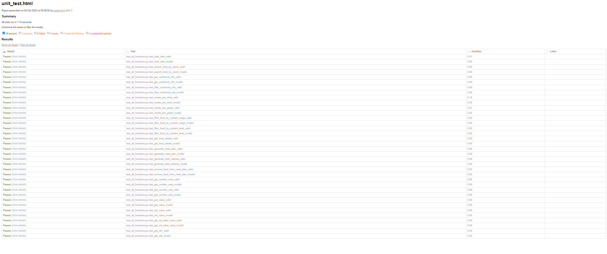

# Unit Testing Report

Please provide your GitHub repository link.
### GitHub Repository URL: https://github.com/UniKatya/Milestone2_Group19.git


---

The testing report should focus solely on <span style="color:red"> testing all the self-defined functions related to 
the five required features.</span> There is no need to test the GUI components. Therefore, it is essential to decouple your code and separate the logic from the GUI-related code.


## 1. **Test Summary**
list all tested functions related to the five required features and the corresponding test functions designed to test 
those functions, for example:

| **Tested Functions**                                                 | **Test Functions**                                                                                           |
|----------------------------------------------------------------------|--------------------------------------------------------------------------------------------------------------|
| `load_data(file_path)`                                               | `test_load_data_valid()` <br> `test_load_data_invalid()`                                                     |
| `search_food_by_name(food_name)`                                     | `test_search_food_by_name_valid()` <br> `test_search_food_by_name_invalid()`                                 |
| `get_nutritional_info(food_name)`                                    | `test_get_nutritional_info_valid(cream_cheese_info)` <br> `test_get_nutritional_info_invalid()`              |
| `filter_nutritional_info(nutritional_info)`                          | `test_filter_nutritional_info_valid(cream_cheese_info)`<br> `test_filter_nutritional_info_invalid()`         |
| `create_pie_chart(filtered_sizes, filtered_categories, explode, ax)` | `test_create_pie_chart_valid()` <br> `test_create_pie_chart_invalid()`                                       |
| `create_bar_graph(filtered_categories, filtered_sizes, ax)`          | `test_create_bar_graph_valid()` <br> `test_create_bar_graph_invalid()`                                       |
| `filter_food_by_nutrient_range(nutrient, min_val, max_val)`          | `test_filter_food_by_nutrient_range_valid()` <br> `test_filter_food_by_nutrient_range_invalid()`             |
| `filter_food_by_nutrient_level(nutrient, level)`                     | `test_filter_food_by_nutrient_level_valid()` <br> `test_filter_food_by_nutrient_level_invalid()`             |
| `get_food_details(food_name, meal_plan)`                             | `test_get_food_details_valid(meal_plan)` <br> `test_get_food_details_invalid(meal_plan)`                     |
| `generate_meal_plan(meal_plan, food_name, quantity)`                 | `test_generate_meal_plan_valid(meal_plan)` <br> `test_generate_meal_plan_invalid(meal_plan)`                 |
| `generate_total_calories(meal_plan)`                                 | `test_generate_total_calories_valid(meal_plan)`  <br> `test_generate_total_calories_invalid(meal_plan)`      |
| `remove_food_from_meal_plan(meal_plan, food_name, quantity)`         | `test_remove_food_from_meal_plan_valid(meal_plan)` <br> `test_remove_food_from_meal_plan_invalid(meal_plan)` |
| `DataTable.GetNumberRows()`                                          | `test_get_number_rows_valid(data_table)` <br>   `test_get_number_rows_invalid()`                             |
| `DataTable.GetNumberCols()`                                          | `test_get_number_cols(data_table)`   <br>  `test_get_number_cols_invalid()`                                  |
| `DataTable.GetValue(row, col)`                                       | `test_get_value_valid(data_table)` <br> `test_get_value_invalid(data_table)`                                 |
| `DataTable.SetValue(row, col, value)`                                | `test_set_value_valid(data_table)` <br> `test_set_value_invalid(data_table)`                                 |
| `DataTable.GetColLabelValue(col)`                                    | `test_get_col_label_value_valid(data_table)` <br> `test_get_col_label_value_invalid(data_table)`             |
| `DataTable.GetAttr(row, col, prop)`                                  | `test_get_attr_valid(data_table)` <br> `test_get_attr_invalid(data_table)`                                   |
---

## 2. **Test Case Details**

### Test Case 1:
- **Test Function/Module**
- `test_load_data_valid()`
- `test_load_data_invalid()`

- **Tested Function/Module**
  - `load_data(file_path)`
- **Description**
  - The function reads the CSV file and returns a pandas dataframe. The input is the file path, and the output is the dataframe.
- **1) Valid Input and Expected Output**  

| **Valid Input**                           | **Expected Output**   |
|-------------------------------------------|-----------------------|
| `load_data('Food_Nutrition_Dataset.csv')` | `Non-empty DataFrame` |

- **1) Code for the Test Function**
```python
def test_load_data_valid():
    df = load_data('Food_Nutrition_Dataset.csv')
    assert not df.empty
```
- **2) Invalid Input and Expected Output**

| **Invalid Input**                    | **Expected Output** |
|--------------------------------------|---------------------|
| `load_data('non_existent_file.csv')` | `Handle Exception`  |

- **2) Code for the Test Function**
```python
def test_load_data_invalid():
    with pytest.raises(FileNotFoundError) as exc_info:
        load_data('non_existent_file.csv')
    assert exc_info.type is FileNotFoundError
```

### Test Case 2:
- **Test Function/Module**
- `test_search_food_by_name_valid()`
- `test_search_food_by_name_invalid()`

- **Tested Function/Module**
  - `search_food_by_name(food_name)`
- **Description**
  -The function reads the CSV file and checks if the specified food name exists in the dataset. A string name representing the food item to search for is the input. While the output is a boolean value (True if the food item exists, False otherwise).
- **1) Valid Input and Expected Output**  

| **Valid Input**                  | **Expected Output** |
|----------------------------------|---------------------|
| `search_food_by_name('apple')`   | `True`              |
| `search_food_by_name('banana')`  | `True`              |
| `search_food_by_name('pudding')` | `False`             |

- **1) Code for the Test Function**
```python
def test_search_food_by_name_valid():
    assert search_food_by_name('apple') == True
    assert search_food_by_name('banana') == True
    assert search_food_by_name('pudding') == False
```
- **2) Invalid Input and Expected Output**

| **Invalid Input**          | **Expected Output** |
|----------------------------|---------------------|
| `search_food_by_name(12)`  | `Handle Exception`  |
| `search_food_by_name(' ')` | `Handle Exception`  |

- **2) Code for the Test Function**
```python
def test_search_food_by_name_invalid():
    with pytest.raises(ValueError) as exc_info:
        search_food_by_name(12)
    assert exc_info.type is ValueError

    with pytest.raises(ValueError) as exc_info:
        search_food_by_name(' ')
    assert exc_info.type is ValueError
```

### Test Case 3:
- **Test Function/Module**
  - `get_nutritional_info_valid(cream_cheese_info)`
  - `get_nutritional_info_invalid()`
- **Tested Function/Module**
  - `get_nutritional_info(food_name)`
- **Description**
  - This function retrieves the nutritional information of the food selected by the user. The input is the food name, which identifies which food must be fetched from the database. And the output is nutritional_info (dictionary) which is the nutritional information of the chosen food.
- **1) Valid Input and Expected Output**  

| **Valid Input**                        | **Expected Output** |
|----------------------------------------|---------------------|
| `get_nutritional_info('cream cheese')` | `cream_cheese_info` |

- **1) Code for the Test Function**
```python
def test_get_nutritional_info_valid(cream_cheese_info):
    assert get_nutritional_info("cream cheese") == cream_cheese_info
```
- **2) Invalid Input and Expected Output**

| **Invalid Input**                 | **Expected Output** |
|-----------------------------------|---------------------|
| `get_nutritional_info('pudding')` | `Handle Exception`  |
| `get_nutritional_info('12')`      | `Handle Exception`  |
| `get_nutritional_info(' ')`       | `Handle Exception`  |

- **2) Code for the Test Function**
```python
def test_get_nutritional_info_invalid():
    with pytest.raises(ValueError) as exc_info:
        get_nutritional_info("pudding")
    assert exc_info.type is ValueError

    with pytest.raises(ValueError) as exc_info:
        get_nutritional_info("12")
    assert exc_info.type is ValueError

    with pytest.raises(ValueError) as exc_info:
        get_nutritional_info(" ")
    assert exc_info.type is ValueError
```

### Test Case 4:
- **Test Function/Module**
  - `filter_nutritional_info_valid(cream_cheese_info)`
  - `filter_nutritional_info_invalid()`
- **Tested Function/Module**
  - `filter_nutritional_info(nutritional_info)`
- **Description**
  - This function filters the nutritional information to exclude zero values and returns the filtered categories, sizes, and explode values for charting.
- **1) Valid Input and Expected Output**  

| **Valid Input**                              | **Expected Output** |
|----------------------------------------------|---------------------|
| `filter_nutritional_info(cream_cheese_info)` | `not None`          |

- **1) Code for the Test Function**
```python
def test_filter_nutritional_info_valid(cream_cheese_info):
    assert filter_nutritional_info(cream_cheese_info) is not None
```
- **2) Invalid Input and Expected Output**

| **Invalid Input**             | **Expected Output** |
|-------------------------------|---------------------|
| `filter_nutritional_info({})` | `Handle Exception`  |

- **2) Code for the Test Function**
```python
def test_filter_nutritional_info_invalid():
    with pytest.raises(ValueError) as exc_info:
        filter_nutritional_info({})
    assert exc_info.type is ValueError
```

### Test Case 5:
- **Test Function/Module**
  - `test_create_pie_chart_valid()`
  - `test_create_pie_chart_invalid()`
- **Tested Function/Module**
  - `create_pie_chart(filtered_sizes, filtered_categories, explode, ax)`
- **Description**
  - This function creates a pie chart using the filtered nutritional information. The input is the filtered sizes, categories, explode values, and ax. The output is a pie chart.
- **1) Valid Input and Expected Output**  

| **Valid Input**                                                                        | **Expected Output** |
|----------------------------------------------------------------------------------------|---------------------|
| `(create_pie_chart([10, 20, 30], ["A", "B", "C"], [0, 0.1, 0], plt.subplots()[1])[0])` | `3`                 |

- **1) Code for the Test Function**
```python
def test_create_pie_chart_valid():
    assert len(create_pie_chart([10, 20, 30], ["A", "B", "C"], [0, 0.1, 0], plt.subplots()[1])[0]) == 3
```
- **2) Invalid Input and Expected Output**

| **Invalid Input**                       | **Expected Output** |
|-----------------------------------------|---------------------|
| `test_create_pie_chart([], [], [], ax)` | `Handle Exception`  |

- **2) Code for the Test Function**
```python
def test_create_pie_chart_invalid():
    fig, ax = plt.subplots()
    with pytest.raises(ValueError) as exc_info:
        create_pie_chart([], [], [], ax)
    assert exc_info.type is ValueError
```


### Test Case 6:
- **Test Function/Module**
- `test_create_bar_graph_valid()`
- `test_create_bar_graph_invalid()`
- **Tested Function/Module**
  - `create_bar_graph(filtered_categories, filtered_sizes, ax)`
- **Description**
  - This function creates a bar graph using the filtered nutritional information. The input is the filtered categories, sizes, and ax. The output is a bar graph.
- **1) Valid Input and Expected Output**  

| **Valid Input**                                                        | **Expected Output** |
|------------------------------------------------------------------------|---------------------|
| `create_bar_graph(["A", "B", "C"], [10, 20, 30], ax), ax)[1].patches)` | `3`                 |

- **1) Code for the Test Function**
```python
def test_create_bar_graph_valid():
    assert len((lambda ax: (create_bar_graph(["A", "B", "C"], [10, 20, 30], ax), ax)[1].patches)(plt.subplots()[1])) 
    == 3
```
- **2) Invalid Input and Expected Output**

| **Invalid Input**              | **Expected Output** |
|--------------------------------|---------------------|
| `create_bar_graph([], [], ax)` | `Handle Exception`  |

- **2) Code for the Test Function**
```python
def test_create_bar_graph_invalid():
    fig, ax = plt.subplots()
    with pytest.raises(ValueError) as exc_info:
        create_bar_graph([], [], ax)
    assert exc_info.type is ValueError
```

### Test Case 7:
- **Test Function/Module**
- `filter_food_by_nutrient_range_valid()`
- `filter_food_by_nutrient_range_invalid()`
- **Tested Function/Module**
  - `filter_food_by_nutrient_range(nutrient, min_val, max_val)`
- **Description**
  - This function filters foods by a nutrient range. The input is the nutrient, min_val, and max_val. The output is the filtered dataframe.
- **1) Valid Input and Expected Output**  

| **Valid Input**                                  | **Expected Output** |
|--------------------------------------------------|---------------------|
| `filter_food_by_nutrient_range("Fat", 0.1, 0.3)` | `311`               |


- **1) Code for the Test Function**
```python
def test_filter_food_by_nutrient_range_valid():
    assert len(filter_food_by_nutrient_range("Fat", 0.1, 0.3)) == 311
```
- **2) Invalid Input and Expected Output**

| **Invalid Input**                                | **Expected Output** |
|--------------------------------------------------|---------------------|
| `filter_food_by_nutrient_range("fat", None, 10)` | `Handle Exception`  |
| `filter_food_by_nutrient_range("fat", 11, None)` | `Handle Exception`  |
| `filter_food_by_nutrient_range("fat", 11, 10)`   | `Handle Exception`  |

- **2) Code for the Test Function**
```python
def test_filter_food_by_nutrient_range_invalid():
    with pytest.raises(ValueError) as exc_info:
        filter_food_by_nutrient_range("fat", None, 10)
    assert exc_info.type is ValueError

    with pytest.raises(ValueError) as exc_info:
        filter_food_by_nutrient_range("fat", 11, None)
    assert exc_info.type is ValueError
    
    with pytest.raises(ValueError) as exc_info:
        filter_food_by_nutrient_range("fat", 11, 10)
    assert exc_info.type is ValueError
```

### Test Case 8:
- **Test Function/Module**
- `test_filter_food_by_level_valid()`
- `test_filter_food_by_level_invalid()`
- **Tested Function/Module**
  - `filter_food_by_nutrient_level(nutrient, level)`
- **Description**
  - This function filters foods by nutrient level (Low, Mid, High). The input is the nutrient, and level. The output is the filtered dataframe.
- **1) Valid Input and Expected Output**  

| **Valid Input**                                | **Expected Output** |
|------------------------------------------------|---------------------|
| `filter_food_by_nutrient_level("Fat", "High")` | `3`                 |
| `filter_food_by_nutrient_level("Fat", "Mid")`  | `11`                |
| `filter_food_by_nutrient_level("Fat", "Low")`  | `2381`              |

- **1) Code for the Test Function**
```python
def test_filter_food_by_nutrient_level_valid():
    assert len(filter_food_by_nutrient_level("Fat", "High")) == 3
    assert len(filter_food_by_nutrient_level("Fat", "Mid")) == 11
    assert len(filter_food_by_nutrient_level("Fat", "Low")) == 2381
```
- **2) Invalid Input and Expected Output**

| **Invalid Input**                              | **Expected Output** |
|------------------------------------------------|---------------------|
| `filter_food_by_nutrient_level("Fat", "loow")` | `Handle Exception`        |

- **2) Code for the Test Function**
```python
def test_filter_food_by_nutrient_level_invalid():
    with pytest.raises(ValueError) as exc_info:
        filter_food_by_nutrient_level("Fat", "loow")
    assert exc_info.type is ValueError
```

### Test Case 9:
- **Test Function/Module**
- `test_get_food_details_valid(meal_plan)`
- `test_get_food_details_invalid(meal_plan)`
- **Tested Function/Module**
  - `get_food_details(food_name, meal_plan)`
- **Description**
  - This function retrieves food details from the meal plan. The input is the dataframe, food_name, and meal_plan. The output is the food details.
- **1) Valid Input and Expected Output**  

| **Valid Input**                        | **Expected Output**   |
|----------------------------------------|-----------------------|
| `get_food_details('apple', meal_plan)` | `'apple'`, `2`, `190` |

- **1) Code for the Test Function**
```python
def test_get_food_details_valid(meal_plan):
    food_key, quantity, total_calories = get_food_details('apple', meal_plan)
    assert food_key == 'apple'
    assert quantity == 2
    assert total_calories == 190
```
- **2) Invalid Input and Expected Output**

| **Invalid Input**                               | **Expected Output** |
|-------------------------------------------------|---------------------|
| `get_food_details('nonexistent_food', meal_plan)` | `Handle Exception`        |
| `get_food_details(12, meal_plan)`               | `Handle Exception`        |

- **2) Code for the Test Function**
```python
def test_get_food_details_invalid(meal_plan):
    with pytest.raises(ValueError) as exc_info:
        get_food_details('nonexistent_food', meal_plan)
    assert exc_info.type is ValueError
    
    with pytest.raises(ValueError) as exc_info:
        get_food_details(12, meal_plan)
    assert exc_info.type is ValueError
```

### Test Case 10:
- **Test Function/Module**
- `test_generate_meal_plan_valid(meal_plan)`
- `test_generate_meal_plan_invalid(meal_plan)`
- **Tested Function/Module**
  - `generate_meal_plan(meal_plan, name, quantity)`
- **Description**
  - This function generates a meal plan by adding food items and their quantities. The input is the meal_plan, name, and quantity. The output is the updated meal plan.
- **1) Valid Input and Expected Output**  

| **Valid Input**                                    | **Expected Output** |
|----------------------------------------------------|---------------------|
| `generate_meal_plan(meal_plan, 'cream cheese', 2)` | `2`                 |
| `generate_meal_plan(meal_plan, 'apple', 3)`        | `5`                 |

- **1) Code for the Test Function**
```python
def test_generate_meal_plan_valid(meal_plan):
    generate_meal_plan(meal_plan, 'cream cheese', 2)
    assert meal_plan['cream cheese'] == 2

    generate_meal_plan(meal_plan, 'apple', 3)
    assert meal_plan['apple'] == 5
```
- **2) Invalid Input and Expected Output**

| **Invalid Input**                             | **Expected Output** |
|-----------------------------------------------|---------------------|
| `generate_meal_plan(meal_plan, 'pudding', 2)` | `Handle Exception`  |
| `generate_meal_plan(meal_plan, 'apple', -2)`  | `Handle Exception`  |
| `generate_meal_plan(meal_plan, 'apple', 51)`  | `Handle Exception`  |

- **2) Code for the Test Function**
```python
def test_generate_meal_plan_invalid(meal_plan):
    with pytest.raises(ValueError) as exc_info:
        generate_meal_plan(meal_plan, 'pudding', 2)
    assert exc_info.type is ValueError

    with pytest.raises(ValueError) as exc_info:
        generate_meal_plan(meal_plan, 'apple', -2)
    assert exc_info.type is ValueError

    with pytest.raises(ValueError) as exc_info:
        generate_meal_plan(meal_plan, 'apple', 51)
    assert exc_info.type is ValueError
```

### Test Case 11:
- **Test Function/Module**
- `test_generate_total_calories_valid(meal_plan)`
- `test_generate_total_calories_invalid(meal_plan)`
- **Tested Function/Module**
  - `generate_total_calories(meal_plan)`
- **Description**
  - This function calculates the total calories in the meal plan. The input is the meal plan. The output is the total calories.
- **1) Valid Input and Expected Output**  

| **Valid Input**                      | **Expected Output** |
|--------------------------------------|---------------------|
| `generate_total_calories(meal_plan)` | `324`               |
| `generate_total_calories({})`        | `0`                 |

- **1) Code for the Test Function**
```python
def test_generate_total_calories_valid(meal_plan):
    assert generate_total_calories(meal_plan) == 324
    assert generate_total_calories({}) == 0
```

- **2) Invalid Input and Expected Output**

| **Invalid Input**             | **Expected Output** |
|-------------------------------|---------------------|
| `generate_total_calories([])` | `Handle Exception`  |

- **2) Code for the Test Function**
```python
def test_generate_total_calories_invalid(meal_plan):
    with pytest.raises(ValueError) as exc_info:
        generate_total_calories([])
    assert exc_info.type is ValueError
```

### Test Case 12:
- **Test Function/Module**
- `test_remove_food_from_meal_plan_valid(meal_plan)`
- `test_remove_food_from_meal_plan_invalid(meal_plan)`
- **Tested Function/Module**
  - `remove_food_from_meal_plan(meal_plan, food_name, quantity)`
- **Description**
  - This function removes a food item from the meal plan. The input is the meal plan and the selected meal food. The output is the updated meal plan.
- **1) Valid Input and Expected Output**  

| **Valid Input**                                     | **Expected Output**         |
|-----------------------------------------------------|-----------------------------|
| `remove_food_from_meal_plan(meal_plan, 'apple', 1)` | `{'apple': 1, 'banana': 1}` |
| `remove_food_from_meal_plan(meal_plan, 'apple', 1)` | `{'banana': 1}`             |

- **1) Code for the Test Function**
```python
def test_remove_food_from_meal_plan_valid(meal_plan):
    remove_food_from_meal_plan(meal_plan, 'apple', 1)
    assert meal_plan == {'apple': 1, 'banana': 1}

    remove_food_from_meal_plan(meal_plan, 'apple', 1)
    assert meal_plan == {'banana': 1}
```
- **2) Invalid Input and Expected Output**

| **Invalid Input**                                    | **Expected Output** |
|------------------------------------------------------|---------------------|
| `remove_food_from_meal_plan(meal_plan, 'carrot', 2)` | `Handle Exception`  |

- **2) Code for the Test Function**
```python
def test_remove_food_from_meal_plan_invalid(meal_plan):
    with pytest.raises(KeyError) as exc_info:
        remove_food_from_meal_plan(meal_plan, 'carrot', 2)
    assert exc_info.type is KeyError
```

### Test Case 13:
- **Test Function/Module**
- `test_get_number_rows(data_table)`
- `test_get_number_rows_invalid()`
- **Tested Function/Module**
  - `DataTable.GetNumberRows()`
- **Description**
  - This functions obtains the number of rows in the data table. The input is the data table. The output is the number of rows.
- **1) Valid Input and Expected Output**  

| **Valid Input**              | **Expected Output** |
|------------------------------|---------------------|
| `data_table.GetNumberRows()` | `3`                 |

- **1) Code for the Test Function**
```python
def test_get_number_rows(data_table):
    assert data_table.GetNumberRows() == 3
```

- **2) Invalid Input and Expected Output**

| **Invalid Input**             | **Expected Output** |
|-------------------------------|---------------------|
| `DataTable().GetNumberRows()` | `Handle Exception`  |

- **2) Code for the Test Function**
```python
def test_get_number_rows_invalid():
    with pytest.raises(AttributeError) as exc_info:
        DataTable().GetNumberRows()
    assert exc_info.type is AttributeError
```

### Test Case 14:
- **Test Function/Module**
- `test_get_number_cols(data_table)`
- `test_get_number_cols_invalid()`
- **Tested Function/Module**
  - `DataTable.GetNumberCols()`
- **Description**
  - This functions obtains the number of columns in the data table. The input is the data table. The output is the number of columns.
- **1) Valid Input and Expected Output**  

| **Valid Input**              | **Expected Output** |
|------------------------------|---------------------|
| `data_table.GetNumberCols()` | `4`                 |

- **1) Code for the Test Function**
```python
def test_get_number_cols(data_table):
    assert data_table.GetNumberCols() == 4
```

- **2) Invalid Input and Expected Output**

| **Invalid Input**             | **Expected Output** |
|-------------------------------|---------------------|
| `DataTable().GetNumberCols()` | `Handle Exception`  |

- **2) Code for the Test Function**
```python
def test_get_number_cols_invalid():
    with pytest.raises(AttributeError) as exc_info:
        DataTable().GetNumberCols()
    assert exc_info.type is AttributeError
```

### Test Case 15:
- **Test Function/Module**
- `test_get_value_valid(data_table)`
- `test_get_value_invalid(data_table)`
- **Tested Function/Module**
  - `DataTable.GetValue(row, col)`
- **Description**
  - The function retrieves the value at the specified row and column in the data table. The input is the row and column. The output is the value.
- **1) Valid Input and Expected Output**  

| **Valid Input**             | **Expected Output** |
|-----------------------------|---------------------|
| `data_table.GetValue(0, 0)` | `'apple'`           |

- **1) Code for the Test Function**
```python
def test_get_value_valid(data_table):
    assert data_table.GetValue(0, 0) == 'apple'
```
- **2) Invalid Input and Expected Output**

| **Invalid Input**             | **Expected Output** |
|-------------------------------|---------------------|
| `data_table.GetValue(10, 10)` | `Handle Exception`  |

- **2) Code for the Test Function**
```python
def test_get_value_invalid(data_table):
    with pytest.raises(IndexError) as exc_info:
        data_table.GetValue(10, 10)
    assert exc_info.type is IndexError
```

### Test Case 16:
- **Test Function/Module**
- `test_set_value_valid(data_table)`
- `test_set_value_invalid(data_table)`
- **Tested Function/Module**
  - `DataTable.SetValue(row, col, value)`
- **Description**
  - The function sets the value at the specified row and column in the data table. The input is the row, column, and value. The output is the updated data table.
- **1) Valid Input and Expected Output**  

| **Valid Input**                 | **Expected Output** |
|---------------------------------|---------------------|
| `data_table.SetValue(0, 0, 10)` | `10`                |

- **1) Code for the Test Function**
```python
def test_set_value_valid(data_table):
    data_table.SetValue(0, 0, 10)
    assert data_table.GetValue(0, 0) == 10
```
- **2) Invalid Input and Expected Output**

| **Invalid Input**                         | **Expected Output** |
|-------------------------------------------|---------------------|
| ` data_table.SetValue(10, 10, 100)` | `Handle Exception`        |

- **2) Code for the Test Function**
```python
def test_set_value_invalid(data_table):
    with pytest.raises(IndexError) as exc_info:
        data_table.SetValue(10, 10, 100)
    assert exc_info.type is IndexError
```

### Test Case 17:
- **Test Function/Module**
- `test_get_col_label_value_valid(data_table)`
- `test_get_col_label_value_invalid(data_table)`
- **Tested Function/Module**
  - `DataTable.GetColLabelValue(col)`
- **Description**
  - The function retrieves the column label value at the specified column index in the data table. The input is the column index. The output is the column label value.
- **1) Valid Input and Expected Output**  

| **Valid Input**                  | **Expected Output** |
|----------------------------------|---------------------|
| `data_table.GetColLabelValue(0)` | `'food'`            |
| `data_table.GetColLabelValue(1)` | `'Caloric Value'`   |

- **1) Code for the Test Function**
```python
def test_get_col_label_value_valid(data_table):
    assert data_table.GetColLabelValue(0) == 'food'
    assert data_table.GetColLabelValue(1) == 'Caloric Value'
```
- **2) Invalid Input and Expected Output**

| **Invalid Input**                   | **Expected Output** |
|-------------------------------------|---------------------|
| `data_table().GetColLabelValue(-1)` | `Handle Exception`        |

- **2) Code for the Test Function**
```python
def test_get_col_label_value_invalid(data_table):
    with pytest.raises(IndexError) as exc_info:
        data_table.GetColLabelValue(10) 
    assert exc_info.type is IndexError
```

### Test Case 18:
- **Test Function/Module**
- `test_get_attr_valid(data_table)`
- `test_get_attr_invalid(data_table)`
- **Tested Function/Module**
  - `DataTable.GetAttr(row, col, prop)`
- **Description**
  - The function retrieves the attribute at the specified row and column in the data table. The input is the row, column, and default attribute. The output is the attribute.
- **1) Valid Input and Expected Output**  

| **Valid Input**              | **Expected Output**         |
|------------------------------|-----------------------------|
| `data_table.GetAttr(3, 0, None).GetBackgroundColour()` | `EVEN_ROW_COLOUR`           |
| `data_table.GetAttr(0, 0, None).HasBackgroundColour()` | `not HasBackgroundColour()` |

- **1) Code for the Test Function**
```python
def test_get_attr_valid(data_table):
    assert data_table.GetAttr(3, 0, None).GetBackgroundColour() == EVEN_ROW_COLOUR
    assert not data_table.GetAttr(0, 0, None).HasBackgroundColour()
```
- **2) Invalid Input and Expected Output**

| **Invalid Input**            | **Expected Output** |
|------------------------------|---------------------|
| `data_table.GetAttr(10, 0, None)` | `not None`          |
| `data_table.GetAttr(0, 10, None)` | `not None`          |

- **2) Code for the Test Function**
```python
def test_get_attr_invalid(data_table):
    assert data_table.GetAttr(10, 0, None) is not None
    assert data_table.GetAttr(0, 10, None) is not None
```

## 3. **Testing Report Summary**
Include a screenshot of unit_test.html showing the results of all the above tests. 

You can use the following command to run the unit tests and generate the unit_test.html report.

```commandline
pytest test_all_functions.py --html=unit_test.html --self-contained-html
```
Note: test_all_functions.py should contain all the test functions designed to test the self-defined functions related 
to the five required features.

